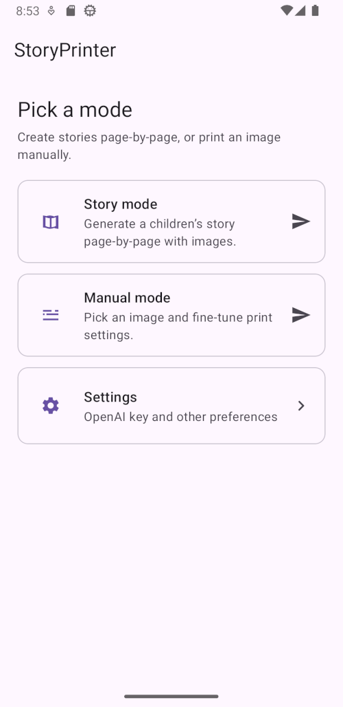
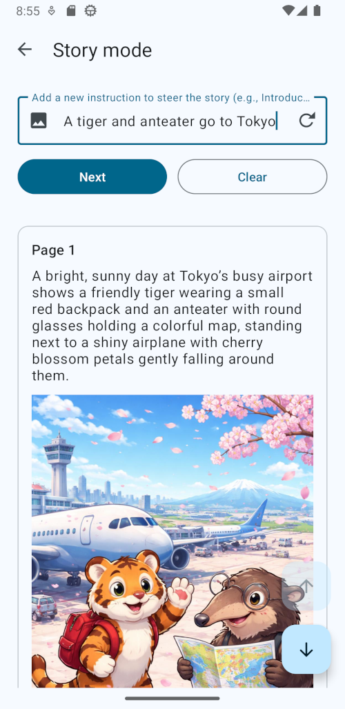
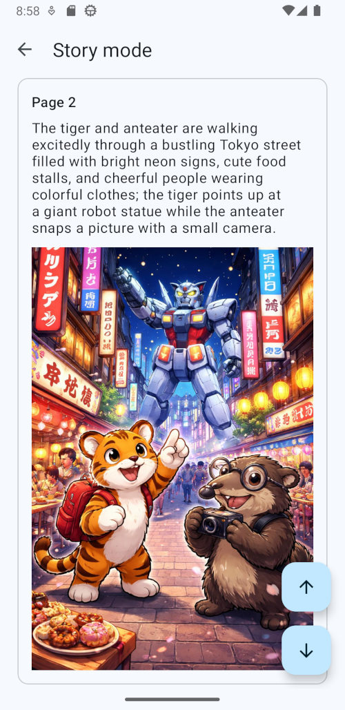
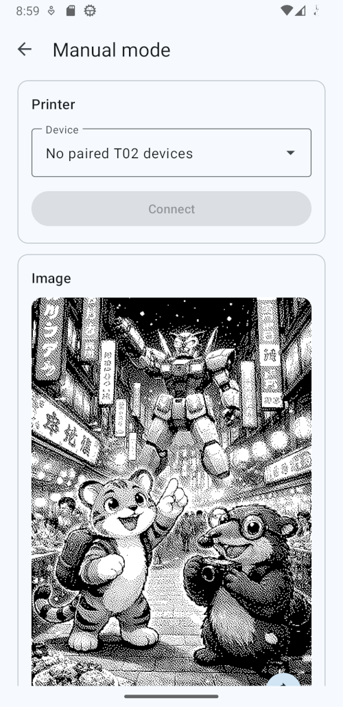
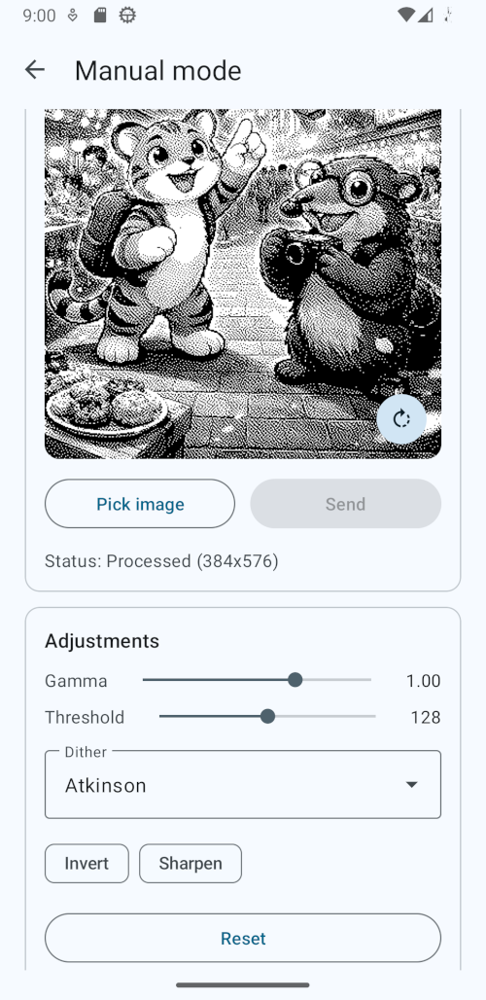

# StoryPrinter

AI-powered children's picture book creator

## What?

StoryPrinter is an Android app that generates illustrated children's stories using AI (OpenAI)
and prints them on a thermal printer.
You describe a story idea, the app produces the text and pictures page by page,
and you can print the result as a tiny picture book your kid can hold and fiddle with.

Step by step:
1. Get yourself a supported thermal printer and some paper rolls
2. Pair it with your Android phone via Bluetooth
3. Provide a story seed (e.g. "A brave little squirrel goes on an adventure")
4. Optionally add a reference image or some clues to guide the art style of the illustrations
5. The app generates the first page of the story, including an illustration
6. Tap next or swipe to see the next page, and the app continues the story in a coherent way, building on what came before
7. Optionally, steer the story in a different direction by providing feedback or changing the reference image
8. Long-press to print any "page" you like
9. Keep printing until your kid gets bored or you run out of paper!

Currently, only the [Phomemo T02](https://phomemo.com/products/t02-portable-printer) thermal printer is supported.
Small modifications to the Bluetooth device filtering and ESC/POS encoding may be needed to support other printers.

    

## Why?

Young children have short attention spans and love tactile experiences.
We should also keep them away from screens.
Holding a printed story they helped create is fun and engaging.
If you get a sticker paper roll, which is all I can find to be honest,
you can even stick the pages around the house, on books, the fridge
and make them part of your kid's environment and playtime.

## How?

The app uses the [OpenAI API](https://platform.openai.com/) to generate all the content.
Story pages are chained together via response IDs so the narrative stays (more or less) coherent across pages.
A user-provided reference image can guide the art style for consistency.

Specifically, the user provides the story seed which is then used to generate prompts for producing images.
In other words, the OpenAI models produce both the images as well as the prompts used to generate the said images.

For printing, images go through a local processing pipeline (scaling, gamma correction, optional sharpening and dithering)
to produce 1-bit bitmaps suitable for thermal paper.
The processed image is sent over Bluetooth SPP to the printer as ESC/POS raster data.

### Dependencies

* [OkHttp](https://square.github.io/okhttp/) for HTTP communication with the OpenAI API
* [Material Components for Android](https://material.io/develop/android) for the UI
* An [OpenAI API key](https://platform.openai.com/api-keys), configured either in the app's settings or via `OPENAI_API_KEY` in `local.properties`

### Get started

I am not intending to publish this app on the Play store, you need to build and install it yourself.
Please use Google or an LLM to find instructions on how to build and install Android apps if you haven't done it before.
If there's enough interest, I might publish the APK here on GitHub,
but I would encourage you to build the app yourself instead of "trusting" a random APK from the internet.